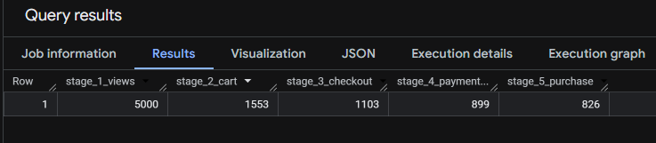
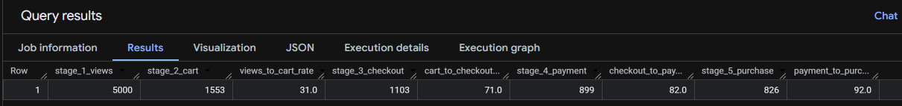

This is a self-made project using a public data set to do with e-commerce data.

Google BigQuery/SQL was used to determine answers to solve several business intelligence/marketing questions that would take place in a real-life scenario.

Schema for table: user_events
-------------------------------------------------------------------------------
| Column | Type | Description |
|----------|----------|----------|
| event_id | INTEGER | Unique event identifier |
| user_id | INTEGER | Unique user identifier |
| event_type | STRING | User action performed |
| event_date | TIMESTAMP | Time of event |
| product_id | INTEGER | Unique product identifier |
| amount | FLOAT | Purchase value |
| traffic_source | STRING | Types of marketing channels |
-------------------------------------------------------------------------------
   
The first task was to create a funnel_stage CTE, so we can determine what the view count is like for visitors on each event_type.

As you can see below, there is a descending trend across each stages of the event types.

This gives us a good baseline on how we can further manipulate the data to give us more insightful information.

Here for the second step, we are calculating what the conversation rales are within the sales funnel:

